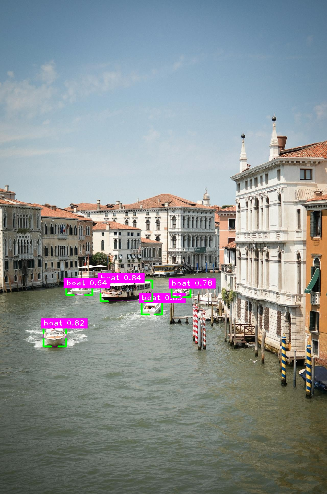

# Real-Time Object Detection with YOLOv8

This project provides a powerful and easy-to-use implementation for object detection using the YOLOv8 model from Ultralytics. It includes two separate Python scripts: one for processing video files and live webcam feeds, and another for analyzing single static images. The scripts are optimized to use a CUDA-enabled GPU if available, falling back to the CPU otherwise.



-----

## 📋 Features

  - **Dual-Mode Detection**: Process both videos (from file or webcam) and single images.
  - **High Performance**: Leverages PyTorch and CUDA for accelerated GPU-based inference. Automatically falls back to CPU if a GPU is not detected.
  - **Rich Annotations**: Draws clear bounding boxes, class labels, and confidence scores on the detected objects using the `cvzone` library.
  - **Output Generation**: Saves the processed video or image to a file for later use.
  - **State-of-the-Art Model**: Utilizes YOLOv8, a highly accurate and fast object detection model, pre-trained on the COCO dataset.
  - **Easy to Use**: The scripts are well-commented and can be easily configured by changing a few variables.

-----

## 🛠️ Tech Stack & Dependencies

  - **Python 3.8+**
  - **PyTorch**: The core deep learning framework.
  - **Ultralytics YOLO**: The official package for the YOLOv8 model.
  - **OpenCV (cv2)**: For video and image reading, writing, and display.
  - **cvzone**: A computer vision library that simplifies drawing and text annotation.

-----

## ⚙️ Installation & Setup

Follow these steps to get the project running on your local machine.

### 1\. Clone the Repository

```bash
git clone https://github.com/imjimit07/Object-Detection-System.git
cd Object-Detection-System
```

### 2\. Install Dependencies

You can install all the required packages using the provided `requirements.txt` file.

Create a file named `requirements.txt` and add the following lines:

```txt
torch
ultralytics
time
cvzone
cv2
```

Then, run the following command in your terminal:

```bash
pip install -r requirements.txt
```

**NVIDIA GPU Users**: For the best performance, it is highly recommended to install the CUDA-enabled version of PyTorch. Please follow the official instructions on the [PyTorch website](https://pytorch.org/get-started/locally/).

-----

## 🚀 Usage

Make sure you have placed your own `test.mp4` and `test.jpg` files in the root directory, or update the file paths inside the scripts.

### To Process a Video File or Webcam

Run the video processing script from your terminal:

```bash
python video.py
```

  - The script will read the `test.mp4` file, perform object detection on each frame, and display the result in a window.
  - The processed video will be saved as `output.mp4`.
  - Press the **'q'** key on the active window to stop the script.

### To Process a Webcam

Run the image processing script from your terminal:

```bash
python webcam.py
```

### To Process a Single Image

Run the image processing script from your terminal:

```bash
python image.py
```

  - The script will read the `test.jpg` file, perform object detection, and display the result in a new window.
  - The processed image will be saved as `output.jpg`.
  - Press any key to close the image window.

-----

## 🔧 Configuration

You can easily modify the following variables at the top of each script:

  - `cap = cv2.VideoCapture(...)`: In `video.py`, change the input video file or webcam ID.
  - `img_path = "..."`: In `image.py`, change the input image file.
  - `output_path = "..."`: In both scripts, change the desired name for the output file.

-----

## 📄 License

This project is licensed under the GPL v3.0 License. See the `LICENSE` file for details.

-----

## 🙏 Acknowledgments

  - This project is built upon the incredible work by the team at [Ultralytics](https://www.google.com/search?q=https://ultralytics.com/) for creating and maintaining the YOLOv8 model.
  - The [OpenCV](https://opencv.org/) library for its versatile computer vision tools.
  - [Pexels](https://www.pexels.com/) for the stock video and photo.